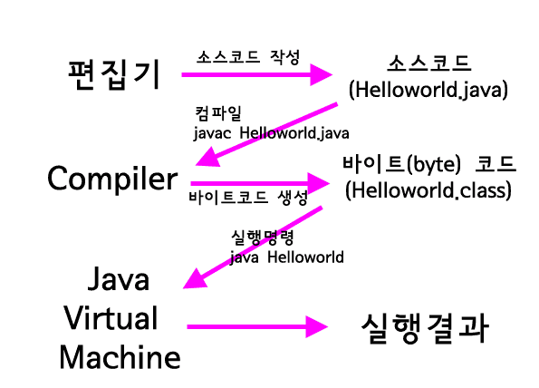

# JAVA COMMAND

## Command
### javac
javac는 java Compile이며 java파일을 컴파일 할 수 있다.
hello.java를 컴파일 하려면 아래의 명령어를 입력하면 되고 명령어 입력 시 컴파일이 되어,
class확장자로 hello.class가 생성된다.
CODE를 Byte Code로 변경한다.

### java
java는 가상머신에 해당 파일을 돌리는 작업이며,
Byte Code를 VM에 전달한다.

;
